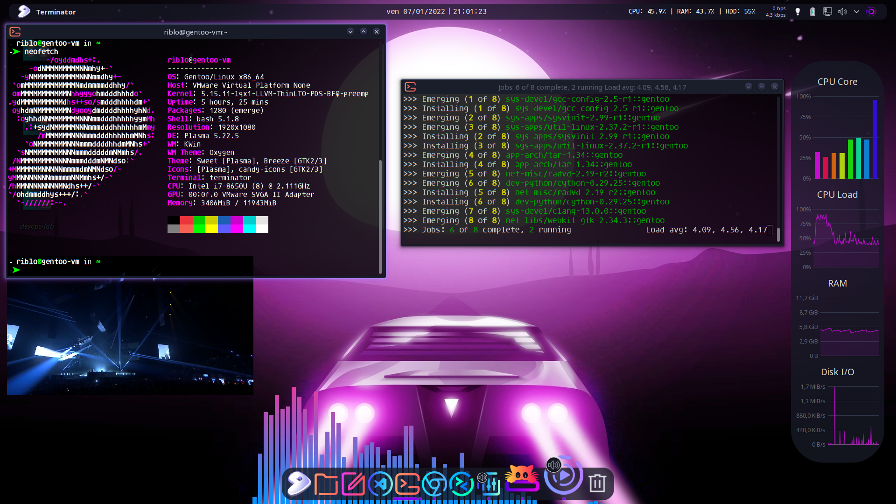

# gentoo-vmware-dotfiles

Highly responsive **Gentoo** plasma desktop on *VMware 15 player* virtual machine:  

## My dotfiles include:
- [latte-dock](https://invent.kde.org/plasma/latte-dock) conf with "on-demand" monitoring right dock
- [terminator](https://terminator-gtk3.readthedocs.io/) conf
- [starship](https://starship.rs/) conf
- custom syntax highlighting and enhanced completion (like *fish*) with [ble.sh](https://github.com/akinomyoga/ble.sh)
- [htop](https://htop.dev/) conf with cpu load graph
- [cava](https://github.com/karlstav/cava) updated conf with blue/purple gradient
- [ytfzf](https://github.com/pystardust/ytfzf) conf
- [kitty](https://sw.kovidgoyal.net/kitty/) conf for smoother cava running
- useful [shopt](https://www.gnu.org/software/bash/manual/html_node/The-Shopt-Builtin.html) behaviors and aliases
- shared/cleaned *history* between terminals (see **References**)
- better colorized output with [grc](https://github.com/garabik/grc)
- *gitconfig* with [delta](https://github.com/dandavison/delta) highlight enabled

## My Gentoo stuffs
- [make.conf](https://wiki.gentoo.org/wiki//etc/portage/make.conf) with custom FEATURES, MAKEOPTS, etc for *Portage* parallel package builds
- [Clang](https://wiki.gentoo.org/wiki/Clang) compiler for *LLVM* alternative toolchain, able to compile *>= Linux 5.12 Kernel* with "Clang LTO support" enabled
- [package.env](https://wiki.gentoo.org/wiki//etc/portage/package.env) for [overriding environment per package](https://wiki.gentoo.org/wiki/Knowledge_Base:Overriding_environment_variables_per_package)
- [custom cflags](https://gcc.gnu.org/onlinedocs/gcc/Optimize-Options.html) per package build optimization (see **References**)
- [package files](https://wiki.gentoo.org/wiki/Handbook:Parts/Portage/Files#User-specific_configuration)
- mounted [Portage_TMPDIR_on_tmpfs](https://wiki.gentoo.org/wiki/Portage_TMPDIR_on_tmpfs)

## Kernel configurations
- [.config](https://www.kernel.org/doc/html/latest/kbuild/makefiles.html?highlight=config%20file#overview) files for the rock-solid [gentoo-sources](https://packages.gentoo.org/packages/sys-kernel/gentoo-sources) and for desktop oriented [xanmod-sources](https://xanmod.org/)
- *Xanmod* sources are intended to be compiled with *Clang/LLVM* toolchain and optimized by *-O3* and *Link Time Optimization* ThinLTO in order to have the best desktop performance 
- *Xanmod* (and all the CFS kernel) could use the runtime "cfs-zen-tweaks" (thanks to https://github.com/owl4ce/cfs-zen-tweaks-openrc for [OpenRC](https://github.com/OpenRC/openrc) porting)

## Scripts
- fast "cpu, ram and disk monitoring" script for  [command output](https://store.kde.org/p/1166510/) applet (I don't like the default graph/bloated, if graphs are needed can be activated "on-demand" on the right dock)
- mousewheel for smoother scroll

## VMware tweaks
- [.vmx](https://kb.vmware.com/s/article/2057902) file with custom options that fixes low-resolution issues and add performance improvement    
- [.ps1](https://docs.microsoft.com/it-it/powershell/scripting/overview?view=powershell-7.2) script to be added into "VMware Player" shortcut, in order to fix *svga.guestBackedPrimaryAware="TRUE"* bug every time the player is started 

## Installation
Some of my settings are experimental and __*maybe dangerous*__ for your system.   
Clone, review the needed code and __*use at your own risk!*__

## TODO
- improve *history* management/approach
- improve *bash* shortcuts
- [WIP] add [fzf](https://github.com/junegunn/fzf) support
- debloat/improve kernel configurations
- try to improve audio latency, playing with [jack](https://github.com/jackaudio) or [pipewire](https://pipewire.org/)
- [JFF] try to resurrect [fbsplash](https://wiki.gentoo.org/wiki/Fbsplash)

## References

#### history improvements && .bashrc stuffs
- https://unix.stackexchange.com/questions/48713/how-can-i-remove-duplicates-in-my-bash-history-preserving-order
- https://unix.stackexchange.com/questions/18212/bash-history-ignoredups-and-erasedups-setting-conflict-with-common-history
- https://portonsoft.wordpress.com/2012/12/02/running-x-sessions/
- https://codeinthehole.com/tips/the-most-important-command-line-tip-incremental-history-searching-with-inputrc/
- https://gist.github.com/tuxfight3r/60051ac67c5f0445efee
- http://mywiki.wooledge.org/BashGuide/Practices
- https://www.baeldung.com/linux/bash-variables-export
#### cflags
- https://gcc.gnu.org/onlinedocs/gcc/Optimize-Options.html
- https://github.com/orsonteodoro/gentoo-cflags
- https://github.com/UoC-Radio/gentoo-stuff
#### vmware && kernel
- https://wiki.gentoo.org/wiki/VMware
- https://wiki.archlinux.org/index.php/VMware/Install_Arch_Linux_as_a_guest
- https://wiki.gentoo.org/wiki/Kernel/Upgrade
- https://forums.gentoo.org/viewtopic-t-961502.html